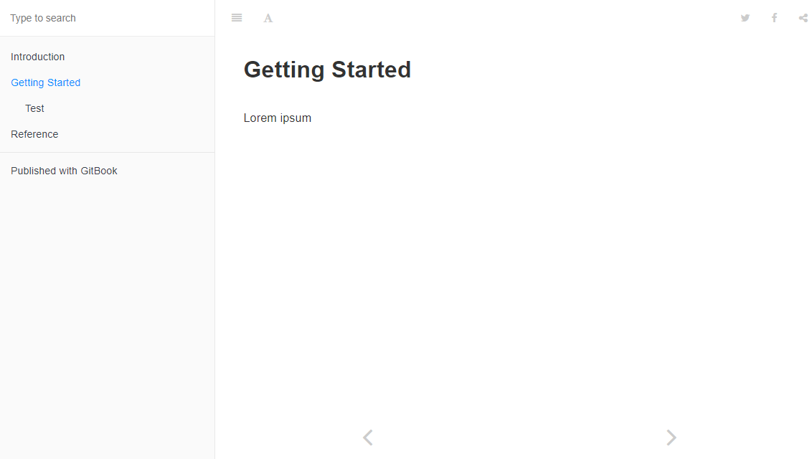

# gitbook-plugin-summary
Gitbook plugin to auto-generate SUMMARY.md

## Introduction

This plugin was created out of the frustration of not having a way to auto-generate a SUMMARY.md file, out of a basic tree structure. The outcome is that you install this plugin and it just works, on top of your current `book.json` file. No custom configurations required.

## Installation

First you need to install the package using

```shell
$ npm i gitbook-plugin-summary --save
```

 afterwards, you need to add to your `book.json` the plugin, like this

```json
{
  ...
  "plugins": [
    "summary"
  ],
  ...
}
```

and finally run the command

```shell
$ gitbook serve
```

## Example

Let's assume that your source tree is done like this way:

```shell
$ tree .
.
├── 1-Getting Started
│   ├── 0-README.md
│   └── 1-TEST.md
├── 2-Reference
│   └── 0-README.md
├── README.md
└── SUMMARY.md
```

your **SUMMARY.md** file will look like this:

```markdown
- [Getting Started](1-Getting Started/0-README.md)
    - [Test](1-Getting Started/1-TEST.md)
- [Reference](2-Reference/0-README.md)
```

and this is how it will be shown inside your Gitbook:



## License

See [LICENSE](LICENSE)
